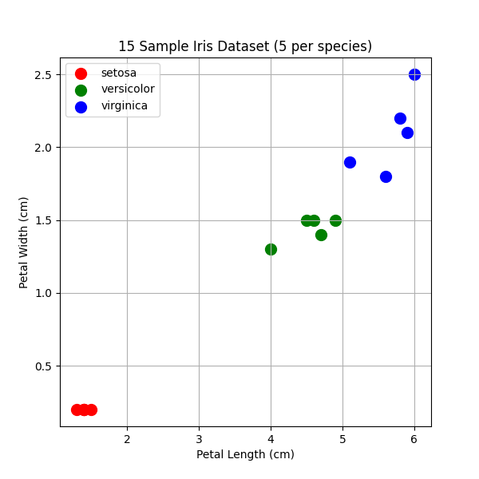

# Foundations Mini Projects – Generative AI Book

This chapter focuses on **hands-on, real-world mini-projects** that build intuition around numerical representation, encoding, quantization, and precision—core ideas behind modern AI systems.

Each project strips away library “magic” and exposes the underlying arithmetic.

This chapter contains three foundational computing mini-projects demonstrating important concepts in programming, numerical computation, and computer architecture.

---


## 1. Mini Project

## A. Emoji Password Strength Checker

### Problem Statement
Analyze the strength of an emoji-based password by examining its **Unicode representation**.

### Concepts
- Unicode encoding  
- Base-16 (hexadecimal)  
- Set cardinality  
- Information entropy  

### Approach
1. Convert each emoji (Unicode character) to its hexadecimal code point.
2. Split the hexadecimal string into **nibbles (4-bit chunks)**.
3. Count the number of **unique nibbles**.
4. Use this count as a proxy for password entropy.

### Outcome
- Demonstrates how symbol diversity increases entropy.
- Shows the connection between **encoding schemes** and **security**.

### Implementation
File:
- `emoji_password_strength.py`

---

## B. RGB Image to Grayscale (Without Libraries)

### Problem Statement
Convert an RGB image to grayscale **without using image-processing libraries**.

### Concept
Human-eye luminosity model:
```
Y = 0.299R + 0.587G + 0.114B
```

### Challenge
Use **only integer arithmetic** (fixed-point math).

### Fixed-Point Strategy
1. Multiply coefficients by 1024  
2. Perform integer arithmetic  
3. Divide the final result by 1024  

### Fixed-Point Formula
```
Y = (306R + 601G + 117B) >> 10
```

### Skills Developed
- Fixed-point arithmetic  
- Quantization  
- Precision control  

### Implementation
File:
- `rgb_to_grayscale_fixed_point.py`

---

## C. 8-Bit Floating-Point “Toy” System

### Problem Statement
Design and experiment with a **custom 8-bit floating-point format**.

### Format Definition
| Component | Bits |
|---------|------|
| Sign    | 1    |
| Exponent | 3   |
| Mantissa | 4   |

### Task
- Encode the value `0.15625`
- Decode it back to a real number

### Concepts
- Floating-point representation  
- Overflow and underflow  
- Precision loss  
- Motivation behind formats like `bfloat16` in deep learning  

### Outcome
A clear understanding of:
- Numerical limitations  
- Precision vs. range trade-offs  
- Why reduced-precision formats dominate AI hardware

### Implementation
File:
- `toy_float8.py`

---

## 2. Machine Epsilon (Python)

### Problem Statement
Find the **smallest positive floating-point number** ε such that:

```
1.0 + ε != 1.0
```

### Concept
- Floating-point precision  
- Machine epsilon  
- Iterative brute-force approach

### Solution
Implemented in [`machine_epsilon.py`](machine_epsilon.py)

### How to Run
```bash
python machine_epsilon.py
```

### Sample Output
```
Machine epsilon: 2.220446049250313e-16
1.0 + eps = 1.0000000000000002
1.0 + eps/2 = 1.0
```

---

## 3. 255 + 1 Overflow (JavaScript)

### Problem Statement
Demonstrate **overflow** of an 8-bit unsigned integer when adding 1 to 255.

### Concept
- Unsigned 8-bit integer (0–255)  
- Overflow wraps around modulo 256  
- Use `Uint8Array` in JavaScript

### Solution
Implemented in [`uint8_overflow.js`](uint8_overflow.js)

### How to Run
```bash
node uint8_overflow.js
```

### Output
```
0
```

**Explanation:**  
Adding 1 to 255 in an 8-bit unsigned integer wraps around to 0 because `Uint8Array` stores only 0–255 values.

---

## 4. Cache Latency vs Memory Size (Python)

### Problem Statement
Measure **memory latency** for different cache levels (L1, L2, L3) and main memory, then fit an **exponential curve** to the latency data.

### Concept
- Cache hierarchy: L1 → L2 → L3 → RAM  
- Latency increases with memory size  
- Exponential growth model:  
```
Latency ≈ a * e^(b * Size)
```

### Solution
Implemented in [`cache_latency_analysis.py`](cache_latency_analysis.py)

### How to Run
```bash
python cache_latency_analysis.py
```

### LMbench Guide
To obtain real latency measurements, follow these steps:
1. **Install lmbench**:
   - Linux: `sudo apt-get install lmbench`
   - Mac: `brew install lmbench`
   - Windows: Use WSL or a Linux VM
2. **Run memory latency test**:
   ```bash
   cd /usr/lib/lmbench/bin
   ./lat_mem_rd 128 4096
   ```
   - `128` → stride in bytes
   - `4096` → memory size in KB
3. **Save results** in a CSV or directly in the Python script.
4. **Replace example arrays** in `cache_latency_analysis.py` with your measurements:
   ```python
   memory_size_kb = [1,2,4,8,16,32,64]
   latency_ns = [1.1,1.2,1.3,2.5,5.8,12.0,30.0]
   ```
5. **Run the script** to generate the plot and exponential fit.

### Notes
- The script generates a **latency vs memory size plot** (`cache_plot.png`) and prints the **exponential fit formula**.  
- Replace example data with your actual `lmbench` measurements.  
- The plot visually demonstrates jumps in latency when moving from one cache level to the next.

---

## 5. Activity: Measuring `np.dot` Speed on Google Colab GPU

## Objective
Measure the speed of `np.dot` for large vectors in FP32 vs FP16 on a Google Colab GPU.

## Steps
1. Open [Google Colab](https://colab.research.google.com) and create a new notebook.  
2. Set **Runtime → Change runtime type → GPU**.  
3. Run the Python script below or link the file.

### Python Script
The code is in [`gpu_dot_product_speed.py`](gpu_dot_product_speed.py)

```bash
python gpu_dot_product_speed.py
```

## Expected Outcome
- FP16 computation will be significantly faster than FP32.  
- GPUs with Tensor Cores are optimized for lower-precision calculations.

---

## 6. Mini-Project: Build an 8-Bit Neural Net in a Spreadsheet

This mini-project demonstrates that a neural network is just a series of **matrix multiplications (dot products) and additions**. By using a spreadsheet, you will see the arithmetic in its purest form without the “magic” of libraries.

## Goal and Challenge
**Goal:** Classify 15 flowers from the Iris dataset using a tiny, hand-coded neural network **without writing Python code**.

**Challenge:** Every number—input, weight, and intermediate result—must be handled as an **8-bit unsigned integer (0–255)** representing the **Q2.6 fixed-point format**, which forces manual quantization.

## Neural Network Architecture

| Component      | Quantity     | Data Type | Notes |
|----------------|------------|-----------|-------|
| Input Layer (x)| 3 features | INT8      | Use 3 of the 4 Iris features |
| Hidden Layer (h)| 2 neurons  | INT8      | With ReLU activation |
| Output Layer (y)| 1 neuron   | INT8      | Classification score |

## Q2.6 Fixed-Point Encoding
**INT8 numbers** range from 0 to 255. To convert into real-world decimal numbers:

\[
\text{Real Value} = \frac{\text{Stored Integer}}{2^6} = \frac{\text{Stored Integer}}{64}
\]

**Examples:**
- Minimum precision: 1/64 = 0.015625  
- Stored value 255 → 255/64 ≈ 3.98  
- Stored value 64 → 64/64 = 1.0  
- Stored value 1 → 1/64 ≈ 0.0156

## Step-by-Step Forward Pass (The Math)

### Hidden Layer Calculation (Single Neuron z1)
\[
z_1 = \text{ReLU}(W_1 \cdot X + b_1)
\]
Where:  
- X = [x1, x2, x3] → input features  
- W1 = [w11, w21, w31] → weights connecting inputs to hidden neuron 1  

**Dot Product:**
```
w1*x1 + w2*x2 + w3*x3
```
- Q2.6 × Q2.6 → Q4.12 number (16-bit: 4 integer + 12 fraction bits)

**Spreadsheet Formula (Pseudo-code):**
```excel
F5 = (B2*C5) + (B3*C6) + (B4*C7)
```
- B2, B3, B4 → input values (X)  
- C5, C6, C7 → weights (W)

### Dequantization / Scaling
Convert Q4.12 back to Q2.6:
\[
z = \text{ReLU}((W \cdot X)/2^6)
\]
**Spreadsheet Formula (Quantized):**
```excel
G5 = ROUNDDOWN((F5 / 64), 0)
```

### ReLU Activation
- Numbers are unsigned; ReLU is simple:
```
ReLU(z) = z if z >= 0
```
- In Excel: ensure result does not go below 0

## Iris Dataset Visualization (15 Samples)

Here’s a scatter plot showing **15 samples from the Iris dataset (5 per species)** used in this mini-project:



## The “Aha!” Moment
Once all 15 inputs are passed through the two layers:
- Outputs classify the flowers correctly (outputs < 128 → class 1, > 128 → class 2)  
- Students realize: **“AI is just arithmetic in a trench coat.”**  
- Neural network is fundamentally **addition and multiplication on carefully controlled numbers**.

